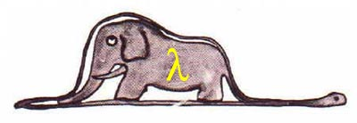
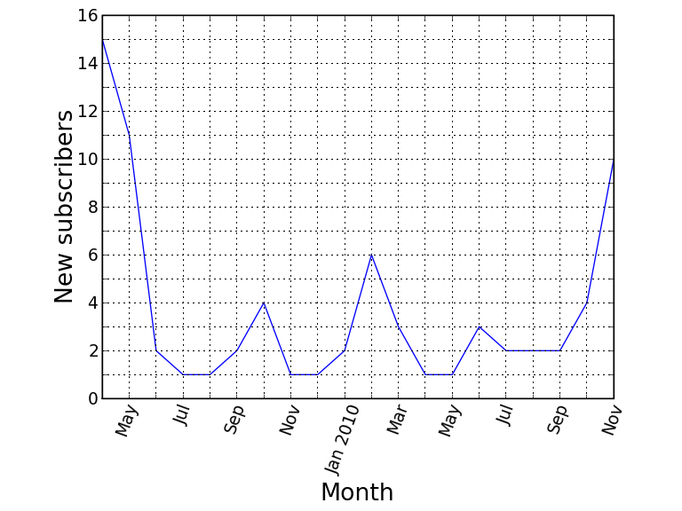

.. |--| unicode:: U+2013   .. en dash
.. |---| unicode:: U+2014  .. em dash

Functional Programming in Python (в примерах)
####################################################################################################

.. raw:: pdf

    Spacer 0,30%

.. raw:: pdf

    Spacer 0,40%

.. class:: centered

`Артем Дударев <http://dudarev.com>`__

.. class:: centered

`кофе-и-код <http://cnc.dn.ua>`__, Донецк, январь 2011

Новые подписчики 
-------------------------------------------

Форматирование оси
-------------------------------------------

.. code-block:: python

    ax = axes([0.15, 0.22, 0.75, 0.75])
    yAxis = ax.yaxis
    yAxis.set_major_formatter(
        ticker.FuncFormatter(
            lambda x, pos: str(x) if x%2 == 0 else ''
        )
    )

`код на github <https://github.com/dudarev/datavis/blob/master/005_list_subscribers/subscribers.py>`__

Нет switch
-------------------------------------------

.. code-block:: python

    {'option1': function1,
     'option2': function2,
     'option3': function3}[value]()

.. code-block:: python

    result = {
      'a': lambda x: x * 5,
      'b': lambda x: x + 7,
      'c': lambda x: x - 2
    }[value](x)

`обсуждение <http://simonwillison.net/2004/May/7/switch/>`__

`еще на stackoverflow.com <http://stackoverflow.com/questions/60208/replacements-for-switch-statement-in-python>`__

Присвоить две переменные из str
--------------------------------

.. code-block:: python

    coord_str = '48,37'
    lat,lon = map(float, coord_str.split(','))
    print lat,lon
    # 48.0 37.0
    ",".join(map(str, (lat,lon)))
    # '48.0,37.0'

Сортировать один список на основе другого
--------------------------------------------

.. code-block:: python

    def psort4(s1, s2):
        _indices = range(len(s1))
        _indices.sort(key=s2.__getitem__)
        s1[:] = map(s1.__getitem__, _indices)

`несколько способов делать это <http://mail.python.org/pipermail/python-list/2006-February/420911.html>`__ (этот самый быстрый)

Удаление элементов из списка
-----------------------------

.. code-block:: python

    a=range(10)
    for item in a:
        if item<5:
            a.remove(item)
    print a 
    # Вернет [1, 3, 5, 6, 7, 8, 9]

.. code-block:: python

    filter(lambda x: x>=5, a)
    [i for i in a if i>=5] # list comprehension
    # Вернут [6, 7, 8, 9]
    # Список а остался неизменным

`из недавней заметки на Хабре <http://habrahabr.ru/blogs/python/111588/>`__

Linkdump 
---------

* `Guido van Rossum о происхождении элементов ФП в Python <http://python-history.blogspot.com/2009/04/origins-of-pythons-functional-features.html>`__ 
* `Перевод поста на Хабре <habr|http://habrahabr.ru/blogs/python/111756/>`__
* `Python Functional Programming HOWTO <http://docs.python.org/howto/functional.html>`__

.. raw:: pdf

    Spacer 0,10%

Основная мысль:

``lambda``, ``map``, ``filter``, ``reduce`` вводились как синтаксический сахар

сейчас чаще употребляются итераторы, генераторы, list comprehension

Credits
--------------------

* `картинка слона <http://wordaligned.org/articles/could-a-python-eat-an-elephant>`__ (блог Thomas Guest)
* `rst2pdf <http://code.google.com/p/rst2pdf/>`__
* частично использовался `стиль <http://blog.notmyidea.org/use-restructured-text-rest-to-power-your-presentations.html>`__ от Alexis Métaireau

.. raw:: pdf

    Spacer 0,20%

* `ссылка на github <http://github.com/dudarev/cncdnua_20110115_python_functional_programming>`__
